# 00 — Project Overview

> Single source of truth: this `/docs` folder. Every other file cross-references this one.
> Related: [01_ARCHITECTURE](./01_ARCHITECTURE.md) · [02_DATABASE_SCHEMA](./02_DATABASE_SCHEMA.md) · [08_TASK_BOARD](./08_TASK_BOARD.md)

## 1. Problem Statement

Organizations must track Environmental, Social, and Governance (ESG) performance, but most ESG reporting today is manual, spreadsheet-driven, disconnected from daily operations, and impossible to see in real time.

**EcoSphere** integrates ESG directly into day-to-day ERP operations: measuring sustainability metrics, driving employee participation through gamification, and producing management-ready reports — all from one platform.

## 2. Business Goal

Give an organization **one live number** (the Overall ESG Score) that is automatically derived from real operational activity (carbon transactions, CSR participation, policy compliance, audits) rather than manually compiled at quarter-end.

## 3. Pain Points Addressed

| Pain Point | Current State | EcoSphere Fix |
|---|---|---|
| Manual carbon accounting | Spreadsheets, delayed | Auto/manual Carbon Transactions tied to Emission Factors |
| Low employee engagement in sustainability | No incentive structure | XP, Badges, Rewards, Leaderboard |
| Governance compliance tracked ad hoc | Email chains, no owner/due-date discipline | Compliance Issues with owner + due date + auto-flagging |
| No unified view | ESG data siloed across departments | Department Score roll-up → Org ESG Score dashboard |

## 4. Target Users (Roles)

| Role | Description |
|---|---|
| **Admin** | Full system configuration: departments, categories, ESG configuration, user/role management |
| **ESG Manager** | Manages Environmental/Social/Governance modules day-to-day: approves CSR participation, runs audits, resolves compliance issues, generates reports |
| **Employee** | Participates: logs CSR involvement, joins Challenges, redeems Rewards, acknowledges policies |
| **Auditor** | Conducts Audits, raises Compliance Issues, views compliance-related reports (read-heavy role) |

Full permission matrix: [07_ROLE_PERMISSIONS](./07_ROLE_PERMISSIONS.md)

## 5. Business Value

- Single dashboard replaces manual quarterly ESG report compilation
- Gamification measurably increases CSR/policy participation rates
- Compliance Issues with owner+due-date reduces governance risk exposure
- Department ranking creates internal competitive pressure toward sustainability goals

## 6. Modules

1. **Environmental** — Emission Factors, Product ESG Profiles, Carbon Transactions, Environmental Goals
2. **Social** — CSR Activities, Employee Participation, Diversity Dashboard
3. **Governance** — Policies, Policy Acknowledgements, Audits, Compliance Issues
4. **Gamification** — Challenges, Challenge Participation, Badges, Rewards, Leaderboard
5. **Reports** — Environmental/Social/Governance/ESG Summary reports, Custom Report Builder
6. **Settings** — Departments, Categories, ESG Configuration, Notification Settings

## 7. Features (traced to wireframe screens 1–7)

| Screen | Key Features |
|---|---|
| Dashboard | 4 score cards (Env/Social/Gov/Overall), Emissions Trend chart, Department ESG Ranking bar chart, Recent Activity feed, Quick Actions |
| Environmental | Emission Factors CRUD, Product ESG Profiles, Carbon Transactions table, Environmental Goals with progress bars |
| Social | CSR Activities cards with Join button, Employee Participation approval queue (Approve/Reject), Diversity Dashboard |
| Governance | Policies CRUD, Policy Acknowledgements, Audits CRUD, Compliance Issues (severity-tagged) |
| Gamification | Challenges (status-filtered: Draft/Active/Under Review/Completed/Archived), Challenge Participation, Badge Gallery, Rewards, Leaderboard |
| Reports | 4 fixed reports + Custom Report Builder with filters (Date Range, Department, Module, Employee, Challenge, ESG Category), export PDF/Excel/CSV |
| Settings | Departments CRUD, Categories CRUD, ESG Configuration toggles, Notification Settings |

## 8. Technology Stack

| Layer | Choice | Rationale |
|---|---|---|
| Frontend | React + Tailwind CSS | Fast iteration, utility classes match wireframe's card/badge-heavy UI |
| Backend | Node.js + Express | Team familiarity, fast REST scaffolding |
| ORM | Prisma | Type-safe schema, migration tooling, fast to iterate under time pressure |
| Database | PostgreSQL | Relational integrity for FK-heavy ESG data model |
| Auth | JWT (access token) | Stateless, simple RBAC middleware |
| Containerization | Docker Compose | One-command environment for all 4 developers |
| Version Control | GitHub with protected `main`/`develop` | See [10_GIT_WORKFLOW](./10_GIT_WORKFLOW.md) |

## 9. Repository Structure

```
ecosphere/
├── docs/                     # this folder — single source of truth
├── backend/
│   ├── prisma/
│   │   ├── schema.prisma
│   │   ├── migrations/
│   │   └── seed.ts
│   ├── src/
│   │   ├── controllers/
│   │   ├── services/
│   │   ├── repositories/
│   │   ├── middleware/
│   │   ├── routes/
│   │   ├── utils/
│   │   └── app.ts
│   └── package.json
├── frontend/
│   ├── src/
│   │   ├── pages/
│   │   ├── components/
│   │   ├── hooks/
│   │   ├── api/
│   │   ├── store/
│   │   └── App.tsx
│   └── package.json
├── docker-compose.yml
└── README.md
```

## 10. Coding Standards

- TypeScript strict mode on both frontend and backend
- ESLint + Prettier, pre-commit via `husky` (skip if time-constrained — see Task Board)
- Controller → Service → Repository layering, never query Prisma directly from a controller
- All API responses follow the envelope in [03_BACKEND_API](./03_BACKEND_API.md#response-format)
- Component names PascalCase, hooks `useX`, files kebab-case except React components

## 11. Definition of Done

A task is **Done** only when:
- [ ] Code implements the acceptance criteria stated in [08_TASK_BOARD](./08_TASK_BOARD.md)
- [ ] No console errors/warnings in dev mode
- [ ] Matches relevant business rule in [05_BUSINESS_RULES](./05_BUSINESS_RULES.md)
- [ ] Manually tested against [13_TESTING_CHECKLIST](./13_TESTING_CHECKLIST.md) row
- [ ] Merged via PR following [10_GIT_WORKFLOW](./10_GIT_WORKFLOW.md)

## 12. Success Criteria (Hackathon Judging Alignment)

| Criteria | How EcoSphere Demonstrates It |
|---|---|
| Functional completeness | MVP scope (see §14 Scope) fully working end-to-end |
| Business rule enforcement | Live demo of validation (e.g. reward redemption blocked on insufficient points) |
| UI/UX polish | Matches wireframe screen-for-screen |
| Data model soundness | Normalized schema, [02_DATABASE_SCHEMA](./02_DATABASE_SCHEMA.md) |
| Technical depth | RBAC, computed scores, auto badge-award engine |

## 13. Project Timeline (8-Hour Hackathon)

```mermaid
gantt
    dateFormat  HH:mm
    axisFormat  %H:%M
    section Setup
    Repo + Docker + Prisma schema      :done, s1, 00:00, 1h
    section Backend
    Auth + Core CRUD (Dept/Category)   :b1, 01:00, 1h30m
    Environmental + Social APIs        :b2, 02:30, 2h
    Governance + Gamification APIs     :b3, 02:30, 2h
    Score calculation engine           :b4, 04:30, 1h
    section Frontend
    Layout + Auth pages + Dashboard    :f1, 01:00, 2h
    Environmental + Social pages       :f2, 03:00, 2h
    Governance + Gamification pages    :f3, 03:00, 2h
    Reports + Settings pages           :f4, 05:00, 1h30m
    section Integration
    Wire frontend to backend           :i1, 05:30, 1h30m
    Bug fixes + polish                 :i2, 07:00, 45m
    Demo rehearsal                     :i3, 07:45, 15m
```



## 14. Milestones

| Milestone | Time Mark | Deliverable |
|---|---|---|
| M1 | Hour 1 | Repo, Docker, DB schema migrated, auth working |
| M2 | Hour 3 | Environmental + Social modules functional |
| M3 | Hour 5 | Governance + Gamification modules functional |
| M4 | Hour 6.5 | All frontend pages wired to live APIs |
| M5 | Hour 7.5 | Reports + dashboard scores computed correctly |
| M6 | Hour 8 | Demo rehearsed, deployed/running locally |

## 15. Risk Analysis

| Risk | Likelihood | Impact | Mitigation |
|---|---|---|---|
| Score formula ambiguity causes rework | High | Medium | Formula locked in [05_BUSINESS_RULES](./05_BUSINESS_RULES.md#score-calculation) before coding starts |
| 4 devs blocked on shared schema | Medium | High | Prisma schema frozen at Hour 1, no changes after without team sync |
| Merge conflicts from parallel work | Medium | Medium | Strict file ownership in [09_TEAM_ASSIGNMENTS](./09_TEAM_ASSIGNMENTS.md) |
| Scope too large for 8 hours | High | High | Hard MVP cut — see §14 Scope below |
| Auto badge-award logic runs late | Medium | Low | Stub with simple synchronous check on participation-approval, not a cron job |

## 16. Scope (MVP — build in 8 hours)

- [ ] Auth (login/signup) + RBAC (4 roles)
- [ ] Departments + Categories CRUD (Settings)
- [ ] Environmental: Emission Factors, Carbon Transactions (manual entry), Environmental Goals with progress
- [ ] Social: CSR Activities, Employee Participation with Approve/Reject
- [ ] Governance: Policies, Policy Acknowledgements, Audits, Compliance Issues
- [ ] Gamification: Challenges, Challenge Participation, XP, Badges (auto-award), Leaderboard
- [ ] Score calculation: Environmental/Social/Governance/Overall, per department
- [ ] Dashboard with 4 score cards, emissions trend, department ranking bar chart
- [ ] Reports: 4 fixed reports (hardcoded queries), CSV export only

## 17. Out of Scope (explicitly cut — mention in pitch, do not build)

- Reward Redemption stock/inventory management (build Rewards catalog view only, redemption button can be a stub)
- Custom Report Builder with live filter combinations (hardcode the 4 fixed reports instead)
- Auto Emission Calculation from Purchase/Manufacturing/Fleet/Expense records (manual Carbon Transaction entry only)
- PDF/Excel export (CSV only)
- Diversity Dashboard detailed metrics (basic headcount by department is enough)
- Email notifications (in-app notification list only)
- Dark/light theme toggle (wireframe is dark — ship dark only)

---
**Next:** [01_ARCHITECTURE.md](./01_ARCHITECTURE.md)
