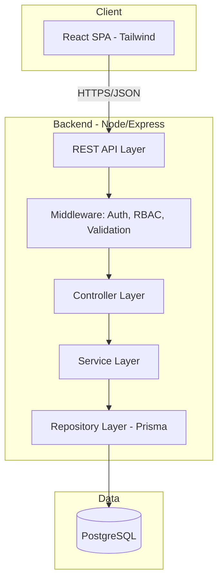
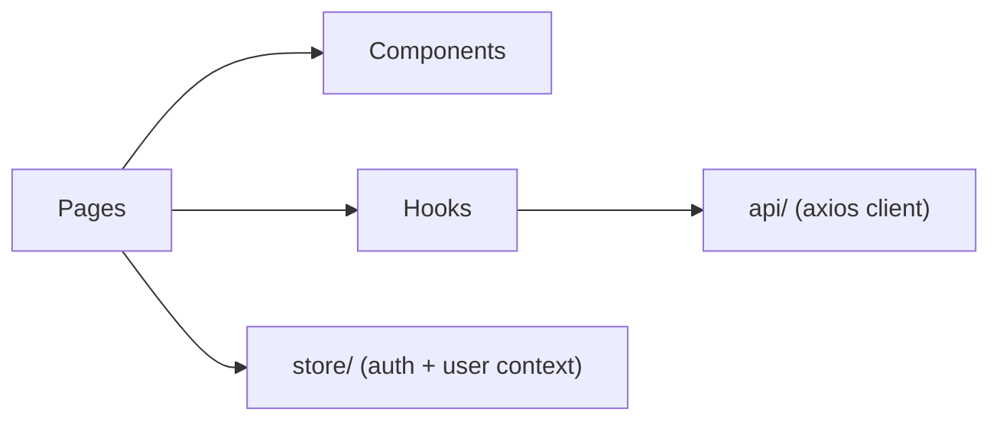
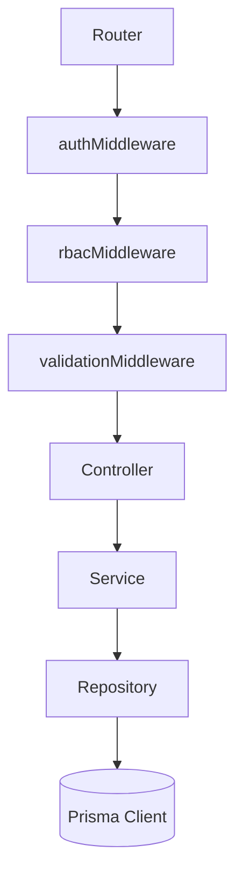
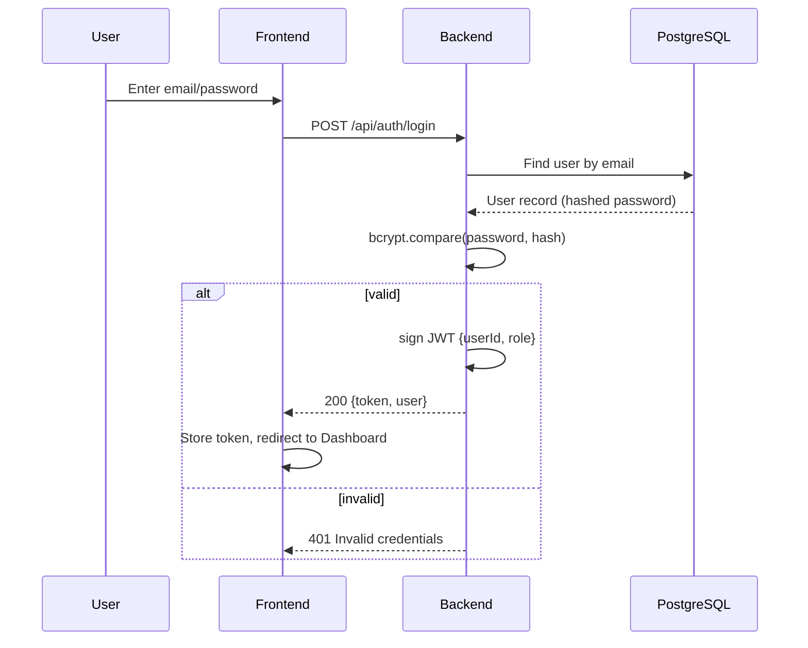
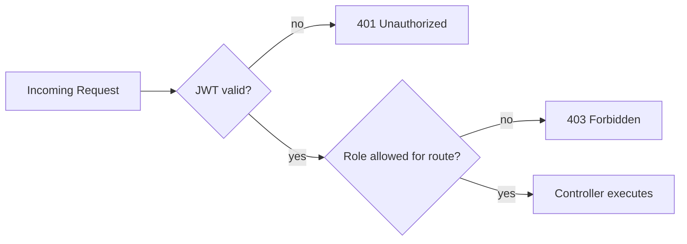
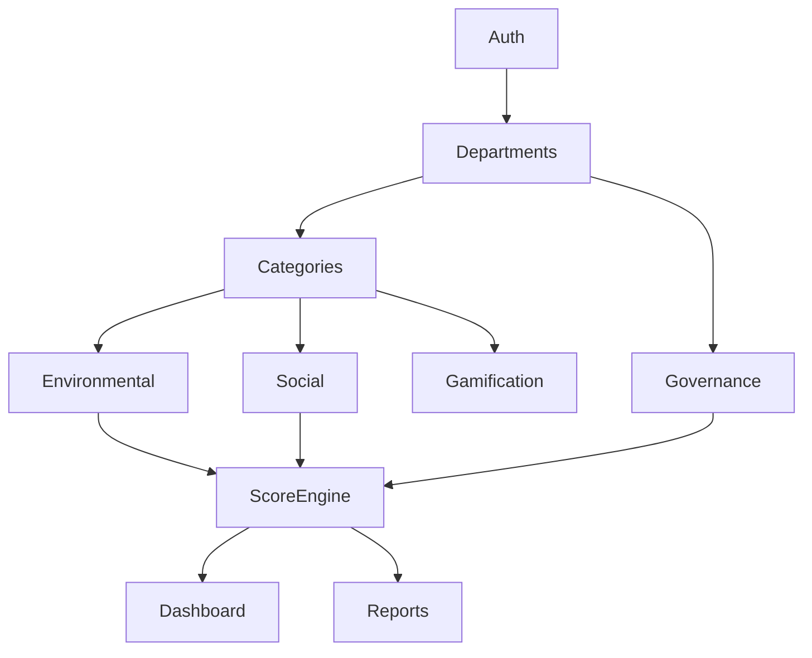
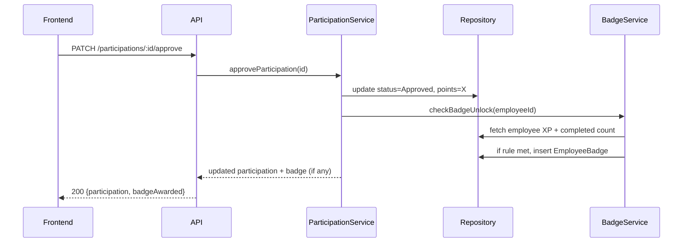
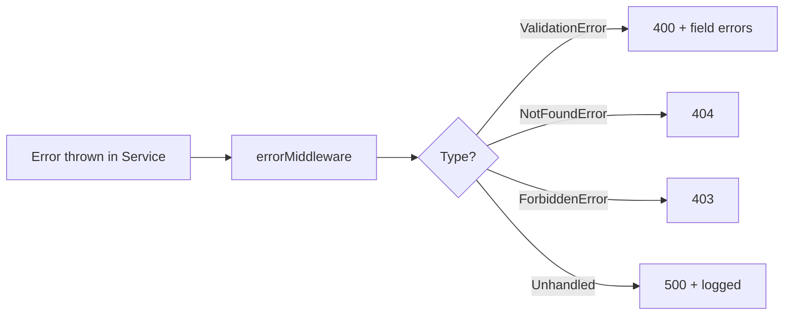
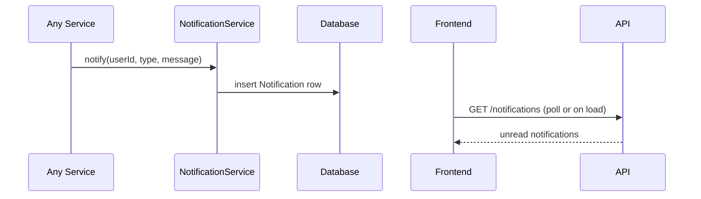

# 01 — Architecture

> Related: [00_PROJECT_OVERVIEW](./00_PROJECT_OVERVIEW.md) · [02_DATABASE_SCHEMA](./02_DATABASE_SCHEMA.md) · [03_BACKEND_API](./03_BACKEND_API.md)

## 1. System Architecture (High Level)

## 2. Layered Architecture

| Layer | Responsibility | Never Does |
|---|---|---|
| Controller | Parse request, call service, shape response | Business logic, DB queries |
| Service | Business rules, score calculation, orchestration | Direct Prisma calls (uses Repository) |
| Repository | Prisma queries only | Business logic |
| Middleware | Auth verification, role check, request validation (zod/joi) | Business logic |

## 3. Frontend Architecture

- **Pages**: one per route (`/dashboard`, `/environmental`, `/social`, `/governance`, `/gamification`, `/reports`, `/settings`)
- **Components**: shared — `ScoreCard`, `DataTable`, `StatusBadge`, `ChallengeCard`, `ApprovalQueue`
- **Hooks**: `useAuth`, `useFetch`, `useRole`
- **Store**: React Context for authenticated user + role (no Redux needed at this scope)

## 4. Backend Architecture

## 5. Authentication Flow

## 6. RBAC Model

- JWT payload: `{ userId, role, departmentId }`
- `rbacMiddleware(allowedRoles: Role[])` checks `req.user.role` against route's allowed list
- Full matrix: [07_ROLE_PERMISSIONS.md](./07_ROLE_PERMISSIONS.md)

## 7. Folder Structure

See [00_PROJECT_OVERVIEW.md §9](./00_PROJECT_OVERVIEW.md#9-repository-structure).

## 8. Dependency Graph (Module Build Order)

**Implication:** Auth and Departments/Categories must be built first (Hour 1) — every other module depends on them. See [09_TEAM_ASSIGNMENTS.md](./09_TEAM_ASSIGNMENTS.md).

## 9. Request Flow (Example: Approve CSR Participation)

## 10. Error Flow

All errors flow through a single Express error-handling middleware — no controller sends raw try/catch error responses. Format: [03_BACKEND_API.md#error-format](./03_BACKEND_API.md#error-format).

## 11. Logging Flow

- Request logger (morgan or pino) at the top of the middleware chain — logs method, path, status, duration
- Business-significant actions (approval, score recalculation, badge award) additionally write to `ActivityLog` table for the Activity Logs / audit trail requirement

## 12. Notification Flow

Triggers: compliance issue raised, CSR/Challenge approval decision, policy acknowledgement reminder, badge unlock — per [05_BUSINESS_RULES.md#notification-rules](./05_BUSINESS_RULES.md#notification-rules).

---
**Next:** [02_DATABASE_SCHEMA.md](./02_DATABASE_SCHEMA.md)

## Backend MVP Implementation Note

The backend implementation uses Express 5, TypeScript ESM, Prisma/PostgreSQL, Zod validation, Bearer JWT authentication, route-level RBAC, request IDs, response envelopes, and centralized Prisma/error normalization.
