# 02 — Database Schema

> Related: [01_ARCHITECTURE](./01_ARCHITECTURE.md) · [03_BACKEND_API](./03_BACKEND_API.md) · [05_BUSINESS_RULES](./05_BUSINESS_RULES.md)
> Database: PostgreSQL 15+ · ORM: Prisma

## 1. Entity Relationship Diagram

```mermaid
erDiagram
  DEPARTMENT ||--o{ USER : employs
  DEPARTMENT ||--o{ DEPARTMENT : "parent of"
  DEPARTMENT ||--o{ DEPARTMENT_SCORE : "scored as"
  USER ||--o{ CARBON_TRANSACTION : logs
  USER ||--o{ EMPLOYEE_PARTICIPATION : participates
  USER ||--o{ CHALLENGE_PARTICIPATION : joins
  USER ||--o{ POLICY_ACKNOWLEDGEMENT : acknowledges
  USER ||--o{ EMPLOYEE_BADGE : earns
  USER ||--o{ REWARD_REDEMPTION : redeems
  USER ||--o{ COMPLIANCE_ISSUE : owns
  USER ||--o{ AUDIT : "audits as"
  USER ||--o{ NOTIFICATION : receives
  USER ||--o{ ACTIVITY_LOG : performs

  CATEGORY ||--o{ CSR_ACTIVITY : categorizes
  CATEGORY ||--o{ CHALLENGE : categorizes

  EMISSION_FACTOR ||--o{ CARBON_TRANSACTION : "used in"
  DEPARTMENT ||--o{ CARBON_TRANSACTION : "attributed to"
  DEPARTMENT ||--o{ ENVIRONMENTAL_GOAL : targets

  CSR_ACTIVITY ||--o{ EMPLOYEE_PARTICIPATION : "participated via"
  CHALLENGE ||--o{ CHALLENGE_PARTICIPATION : "participated via"

  ESG_POLICY ||--o{ POLICY_ACKNOWLEDGEMENT : "acknowledged via"
  AUDIT ||--o{ COMPLIANCE_ISSUE : raises
  DEPARTMENT ||--o{ AUDIT : "audited in"
  DEPARTMENT ||--o{ COMPLIANCE_ISSUE : "belongs to"

  BADGE ||--o{ EMPLOYEE_BADGE : "unlocked as"
  REWARD ||--o{ REWARD_REDEMPTION : "redeemed as"

  USER {
    uuid id PK
    string email UK
    string password_hash
    string name
    enum role
    uuid department_id FK
    boolean is_active
    timestamp created_at
    timestamp updated_at
  }

  DEPARTMENT {
    uuid id PK
    string name
    string code UK
    uuid head_user_id FK
    uuid parent_department_id FK
    enum status
    timestamp created_at
  }

  CATEGORY {
    uuid id PK
    string name
    enum type
    enum status
  }

  EMISSION_FACTOR {
    uuid id PK
    string activity_name
    float factor_value
    string unit
    timestamp created_at
  }

  CARBON_TRANSACTION {
    uuid id PK
    uuid department_id FK
    uuid emission_factor_id FK
    uuid logged_by FK
    float quantity
    float calculated_emission
    date transaction_date
    string source
    timestamp created_at
  }

  ENVIRONMENTAL_GOAL {
    uuid id PK
    string name
    uuid department_id FK
    float target_co2
    float current_co2
    date deadline
    enum status
  }

  CSR_ACTIVITY {
    uuid id PK
    string title
    uuid category_id FK
    string description
    boolean evidence_required
    enum status
    date event_date
  }

  EMPLOYEE_PARTICIPATION {
    uuid id PK
    uuid employee_id FK
    uuid activity_id FK
    string proof_url
    enum approval_status
    int points_earned
    date completion_date
  }

  CHALLENGE {
    uuid id PK
    string title
    uuid category_id FK
    string description
    int xp
    enum difficulty
    boolean evidence_required
    date deadline
    enum status
  }

  CHALLENGE_PARTICIPATION {
    uuid id PK
    uuid challenge_id FK
    uuid employee_id FK
    int progress
    string proof_url
    enum approval_status
    int xp_awarded
  }

  BADGE {
    uuid id PK
    string name
    string description
    string unlock_rule
    string icon
  }

  EMPLOYEE_BADGE {
    uuid id PK
    uuid employee_id FK
    uuid badge_id FK
    timestamp unlocked_at
  }

  REWARD {
    uuid id PK
    string name
    string description
    int points_required
    int stock
    enum status
  }

  REWARD_REDEMPTION {
    uuid id PK
    uuid employee_id FK
    uuid reward_id FK
    int points_spent
    timestamp redeemed_at
  }

  ESG_POLICY {
    uuid id PK
    string title
    string document_url
    enum status
    timestamp published_at
  }

  POLICY_ACKNOWLEDGEMENT {
    uuid id PK
    uuid policy_id FK
    uuid employee_id FK
    timestamp acknowledged_at
  }

  AUDIT {
    uuid id PK
    string title
    uuid department_id FK
    uuid auditor_id FK
    date scope_start
    date scope_end
    string findings
    enum status
  }

  COMPLIANCE_ISSUE {
    uuid id PK
    uuid audit_id FK
    uuid department_id FK
    string description
    enum severity
    uuid owner_id FK
    date due_date
    enum status
    boolean is_overdue
  }

  DEPARTMENT_SCORE {
    uuid id PK
    uuid department_id FK
    float environmental_score
    float social_score
    float governance_score
    float total_score
    date computed_for
  }

  NOTIFICATION {
    uuid id PK
    uuid user_id FK
    string type
    string message
    boolean is_read
    timestamp created_at
  }

  ACTIVITY_LOG {
    uuid id PK
    uuid user_id FK
    string action
    string entity_type
    uuid entity_id
    timestamp created_at
  }
```



## 2. Enums

| Enum | Values |
|---|---|
| `Role` | `ADMIN`, `ESG_MANAGER`, `EMPLOYEE`, `AUDITOR` |
| `DepartmentStatus` | `ACTIVE`, `INACTIVE` |
| `CategoryType` | `CSR_ACTIVITY`, `CHALLENGE` |
| `GoalStatus` | `ACTIVE`, `ON_TRACK`, `AT_RISK`, `COMPLETED` |
| `ActivityStatus` | `DRAFT`, `ACTIVE`, `CLOSED` |
| `ApprovalStatus` | `PENDING`, `APPROVED`, `REJECTED` |
| `ChallengeStatus` | `DRAFT`, `ACTIVE`, `UNDER_REVIEW`, `COMPLETED`, `ARCHIVED` |
| `Difficulty` | `EASY`, `MEDIUM`, `HARD` |
| `RewardStatus` | `ACTIVE`, `INACTIVE` |
| `PolicyStatus` | `DRAFT`, `PUBLISHED`, `ARCHIVED` |
| `AuditStatus` | `SCHEDULED`, `UNDER_REVIEW`, `COMPLETED` |
| `Severity` | `LOW`, `MEDIUM`, `HIGH` |
| `IssueStatus` | `OPEN`, `RESOLVED` |

## 3. Column-Level Detail (representative — full table below)

| Table | Column | Type | Nullable | Constraint |
|---|---|---|---|---|
| User | email | VARCHAR(255) | No | UNIQUE |
| User | password_hash | VARCHAR(255) | No | — |
| User | role | ENUM(Role) | No | DEFAULT 'EMPLOYEE' |
| User | department_id | UUID | Yes | FK → Department.id, ON DELETE SET NULL |
| Department | code | VARCHAR(20) | No | UNIQUE |
| Department | parent_department_id | UUID | Yes | FK → Department.id (self), ON DELETE SET NULL |
| CarbonTransaction | department_id | UUID | No | FK → Department.id, ON DELETE RESTRICT |
| CarbonTransaction | emission_factor_id | UUID | No | FK → EmissionFactor.id, ON DELETE RESTRICT |
| EmployeeParticipation | activity_id | UUID | No | FK → CSRActivity.id, ON DELETE CASCADE |
| ComplianceIssue | owner_id | UUID | No | FK → User.id, ON DELETE RESTRICT |
| ComplianceIssue | due_date | DATE | No | — |
| RewardRedemption | points_spent | INT | No | CHECK (points_spent > 0) |

*(Full column spec for all 20 tables lives in `backend/prisma/schema.prisma` — see §5. This table shows the pattern; every FK follows the same documentation convention.)*

## 4. Relationships Summary

| Relationship | Type |
|---|---|
| Department → User | One-to-Many |
| Department → Department (parent) | One-to-Many (self-referential) |
| User → CarbonTransaction | One-to-Many |
| CSRActivity → EmployeeParticipation | One-to-Many |
| Challenge → ChallengeParticipation | One-to-Many |
| User ↔ Badge (via EmployeeBadge) | Many-to-Many |
| User ↔ Reward (via RewardRedemption) | Many-to-Many |
| ESGPolicy ↔ User (via PolicyAcknowledgement) | Many-to-Many |
| Audit → ComplianceIssue | One-to-Many |
| Department → DepartmentScore | One-to-Many (one row per computation period) |

## 5. Normalization Explanation

Schema is in **3NF**:
- No repeating groups (e.g. participation records are rows, not columns on User)
- No partial dependencies (junction tables `EmployeeBadge`, `RewardRedemption`, `PolicyAcknowledgement` carry only FK + transactional data, not duplicated entity attributes)
- No transitive dependencies (e.g. `DepartmentScore` stores computed values separately from `Department` — scores are a time-series, not a department attribute, since they're computed per period)

`calculated_emission` on `CarbonTransaction` is a deliberate denormalization (quantity × factor, stored at insert time) so historical transactions remain accurate even if an `EmissionFactor.factor_value` changes later.

## 6. Soft Delete Strategy

MVP uses **status enums** (`ACTIVE`/`INACTIVE`, `DRAFT`/`ARCHIVED`) rather than a global `deleted_at` column — matches wireframe's "deactivate department" pattern rather than hard delete. Only `Category` and `Department` use this; other transactional tables (CarbonTransaction, Participation) are never deleted, only their approval status changes.

## 7. Audit Columns

All tables include `created_at` (default `now()`). Mutable tables (User, Department, Goal, Challenge) also include `updated_at` (Prisma `@updatedAt`). Full user-action audit trail is the separate `ActivityLog` table, not per-row columns.

## 8. SQL Creation Order (migration dependency order)

1. `Department` (self-referential FK added after table exists)
2. `User`
3. `Category`
4. `EmissionFactor`
5. `CarbonTransaction`
6. `EnvironmentalGoal`
7. `CSRActivity`
8. `EmployeeParticipation`
9. `Challenge`
10. `ChallengeParticipation`
11. `Badge`, `EmployeeBadge`
12. `Reward`, `RewardRedemption`
13. `ESGPolicy`, `PolicyAcknowledgement`
14. `Audit`
15. `ComplianceIssue`
16. `DepartmentScore`
17. `Notification`
18. `ActivityLog`

## 9. Prisma Schema (excerpt — full file at `backend/prisma/schema.prisma`)

```prisma
generator client {
  provider = "prisma-client-js"
}

datasource db {
  provider = "postgresql"
  url      = env("DATABASE_URL")
}

enum Role {
  ADMIN
  ESG_MANAGER
  EMPLOYEE
  AUDITOR
}

model Department {
  id          String   @id @default(uuid())
  name        String
  code        String   @unique
  headUserId  String?
  parentId    String?
  parent      Department? @relation("DeptHierarchy", fields: [parentId], references: [id])
  children    Department[] @relation("DeptHierarchy")
  status      DepartmentStatus @default(ACTIVE)
  users       User[]
  createdAt   DateTime @default(now())
}

model User {
  id           String   @id @default(uuid())
  email        String   @unique
  passwordHash String
  name         String
  role         Role     @default(EMPLOYEE)
  departmentId String?
  department   Department? @relation(fields: [departmentId], references: [id])
  isActive     Boolean  @default(true)
  createdAt    DateTime @default(now())
  updatedAt    DateTime @updatedAt
}

model CarbonTransaction {
  id                 String   @id @default(uuid())
  departmentId       String
  department         Department @relation(fields: [departmentId], references: [id])
  emissionFactorId   String
  emissionFactor     EmissionFactor @relation(fields: [emissionFactorId], references: [id])
  loggedBy           String
  quantity           Float
  calculatedEmission Float
  transactionDate    DateTime @db.Date
  source             String
  createdAt          DateTime @default(now())
}

// ... remaining 16 models follow the same pattern — see full schema.prisma in repo
```

## 10. Migration Order

```bash
npx prisma migrate dev --name init          # creates all tables in dependency order above
npx prisma generate                          # generates typed client
npx prisma db seed                           # runs seed.ts
```

## 11. Seed Data (minimum for demo)

- [ ] 3 Departments (Manufacturing, Logistics, Corporate) — one with `parentId` set to show hierarchy
- [ ] 4 Users, one per role
- [ ] 2 Categories per type (CSR_ACTIVITY, CHALLENGE)
- [ ] 3 Emission Factors
- [ ] 5 Carbon Transactions across departments
- [ ] 2 Environmental Goals (one ACTIVE, one COMPLETED)
- [ ] 4 CSR Activities matching wireframe (Tree Plantation, Blood Donation, Beach Cleanup, ESG Workshop)
- [ ] 3 Challenges (one per non-terminal status)
- [ ] 4 Badges (Green Beginner, Carbon Saver, Sustainability Champion, Team Player)
- [ ] 2 Rewards
- [ ] 2 Policies + acknowledgement records
- [ ] 2 Audits with Compliance Issues (one High/Open, one Medium/Resolved)

---
**Next:** [03_BACKEND_API.md](./03_BACKEND_API.md)
