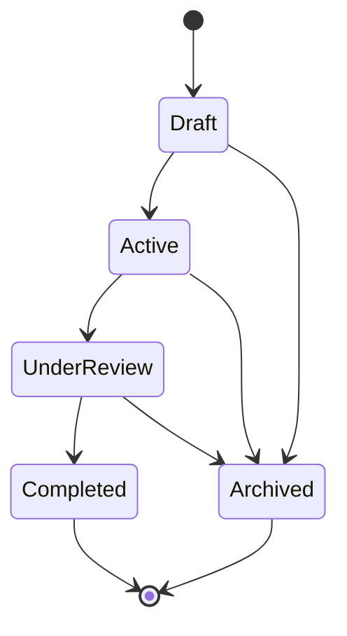
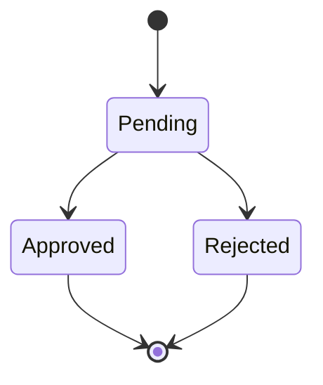
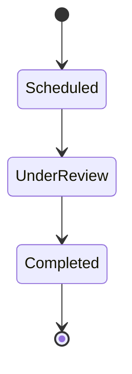

# 05 — Business Rules

> Related: [02_DATABASE_SCHEMA](./02_DATABASE_SCHEMA.md) · [03_BACKEND_API](./03_BACKEND_API.md) · [06_WORKFLOWS](./06_WORKFLOWS.md)
> This is the most important file in the repo. Every rule below must be enforced server-side, not just in the UI.

## 1. Score Calculation (the single most important derived rule — locked before coding)

The problem statement specifies only the final weighted roll-up (Environmental 40% / Social 30% / Governance 30%, configurable). It does **not** define the three sub-score formulas — this is an underspecified requirement, so the following formulas are the team's documented assumption:

| Score | Formula | Why |
|---|---|---|
| **Environmental Score** | `avg over active goals of min(100, current_co2_reduction / target_co2_reduction * 100)` | Rewards progress toward stated targets rather than absolute emissions, which vary wildly by department size |
| **Social Score** | `(employees with ≥1 Approved participation in period / total active employees in department) * 100` | Measures actual engagement breadth, not just activity count |
| **Governance Score** | `100 - (open compliance issues weighted by severity / total issues * 100)`, weighted: High=3, Medium=2, Low=1 | Penalizes unresolved risk proportionally to severity |
| **Department Total Score** | `Environmental*0.4 + Social*0.3 + Governance*0.3` (weights configurable via ESG Configuration) | Per problem statement §5 |
| **Overall ESG Score** | weighted average of all `DepartmentTotalScore` values, weighted by department employee count | Prevents a 3-person department from skewing the org score as much as a 300-person one |

All sub-scores are clamped to `[0, 100]`. Recompute on a schedule (nightly cron) **and** on-demand when Dashboard is loaded if no score exists for today — see [06_WORKFLOWS.md](./06_WORKFLOWS.md#report-generation).

- [ ] Formula reviewed and agreed by full team before Hour 1 ends — do not let one developer decide silently

## 2. Validation Rules

| Entity | Rule |
|---|---|
| Department | `code` unique; cannot set `parentDepartmentId` to itself or create a cycle |
| CarbonTransaction | `quantity > 0`; `calculatedEmission = quantity * emissionFactor.factorValue`, computed server-side, never trusted from client |
| EnvironmentalGoal | `deadline` must be ≥ creation date; `currentCo2` cannot exceed `targetCo2` in display (clamped for progress bar, raw value still stored) |
| CSRActivity | if `evidenceRequired = true`, `EmployeeParticipation.proof` is mandatory before it can move to `Approved` |
| Challenge | `xp > 0`; cannot transition to `Active` without at least one Category assigned |
| ComplianceIssue | `dueDate` and `owner` are mandatory at creation (non-negotiable per problem statement §8) |
| RewardRedemption | blocked unless `employee.totalPoints >= reward.pointsRequired` AND `reward.stock > 0` |
| PolicyAcknowledgement | one acknowledgement per (policy, employee) pair — unique constraint, re-submission is a no-op |

## 3. State Transitions

### Challenge Lifecycle

**Rule**: Archived is reachable from any non-terminal state (per problem statement: "or Archived at any point"). Completed and Archived are terminal — no further transitions.

### Employee/Challenge Participation Approval

**Rule**: Approved is irreversible in MVP (no un-approve) — if a mistake is made, an Admin edits `pointsEarned` directly rather than reopening the workflow.

### Audit Lifecycle

**Rule**: Compliance Issues can only be raised while an Audit is `UnderReview` or being closed to `Completed` — not on a `Scheduled` audit with no findings yet.

## 4. Permissions (summary — full matrix in [07_ROLE_PERMISSIONS](./07_ROLE_PERMISSIONS.md))

- Only **Admin** can create/edit Departments, Categories, ESG Configuration
- Only **ESG Manager** and **Admin** can Approve/Reject participations, close Audits, resolve Compliance Issues
- **Auditor** can create Audits and raise Compliance Issues, but cannot approve CSR/Challenge participations
- **Employee** can only Join activities/challenges, acknowledge policies, redeem rewards — never approve their own submissions (server rejects self-approval even if role were somehow elevated)

## 5. Edge Cases & Failure Cases

| Scenario | Expected Behavior |
|---|---|
| Employee tries to redeem reward with exactly enough points | Allowed — check is `>=`, not `>` |
| Two employees redeem the last unit of stock simultaneously | Second request fails with `409 Conflict` — stock decrement must be an atomic DB operation (`WHERE stock > 0`), not read-then-write |
| Department is deactivated while it still has active Users | Allowed to deactivate; Users keep their `departmentId` but department-level scoring for that department stops appearing on "Active" filtered views |
| Compliance Issue's due date passes while status is still Open | `is_overdue` flag flips to `true` via nightly cron; feeds Notification (see §7) |
| Badge unlock rule is met but ESG Configuration has `autoBadgeAward = false` | Badge is NOT awarded automatically; sits as a manual-award candidate (out of MVP scope — auto-award only, toggle off means badges are simply never awarded in MVP) |
| Employee joins a Challenge that's already `Completed` or `Archived` | `400` — join is only allowed on `Active` challenges |
| CSR Activity is Closed while participations are still Pending | Pending participations remain reviewable by ESG Manager (approval doesn't require the activity to still be open) |

## 6. Auto Calculations

- `CarbonTransaction.calculatedEmission` — computed at insert, server-side only
- `EnvironmentalGoal` progress percentage — `min(100, currentCo2/targetCo2*100)`, computed on read, not stored
- `DepartmentScore` — computed nightly + on-demand (see §1)
- `ComplianceIssue.is_overdue` — computed nightly cron comparing `dueDate < today AND status = OPEN`

## 7. Auto Badge Rules

- Trigger: after any `EmployeeParticipation` or `ChallengeParticipation` moves to `Approved`
- Engine checks each `Badge.unlockRule` against the employee's updated totals (total XP, completed-challenge count, total approved CSR participations)
- Unlock rule format for MVP (simple, string-parsed): `"XP>=500"`, `"CHALLENGES_COMPLETED>=3"`, `"CSR_PARTICIPATIONS>=5"`
- On match, insert `EmployeeBadge` row (if not already earned) → triggers Notification
- Only runs if `ESGConfiguration.autoBadgeAward = true`

## 8. Reward Rules

- Redemption deducts `reward.pointsRequired` from employee's running point total (computed as sum of all `pointsEarned` + `xpAwarded` minus sum of prior `pointsSpent`)
- Redemption decrements `reward.stock` by 1, atomically
- A reward with `stock = 0` is shown as disabled/"Out of stock", not hidden

## 9. Notification Rules

| Trigger | Recipient | Message Pattern |
|---|---|---|
| New Compliance Issue raised | Issue owner | "New compliance issue assigned: {description}" |
| CSR/Challenge participation approved or rejected | Employee | "Your submission for {activity/challenge} was {approved/rejected}" |
| Policy published | All employees | "New policy requires acknowledgement: {title}" |
| Policy acknowledgement reminder | Employees who haven't acknowledged after N days | "Reminder: acknowledge {policy title}" (cron-driven, stretch) |
| Badge unlocked | Employee | "You unlocked the {badge name} badge!" |
| Compliance issue becomes overdue | Owner + ESG Manager | "Compliance issue {description} is now overdue" |

## 10. Approval Rules

- CSR/Challenge participation approval requires role `ESG_MANAGER` or `ADMIN`
- Approval is blocked (400) if `evidenceRequired = true` and `proof` is null
- Audit closing (`Completed`) requires role `ESG_MANAGER`, `ADMIN`, or the assigned `AUDITOR`

---
**Next:** [06_WORKFLOWS.md](./06_WORKFLOWS.md)
