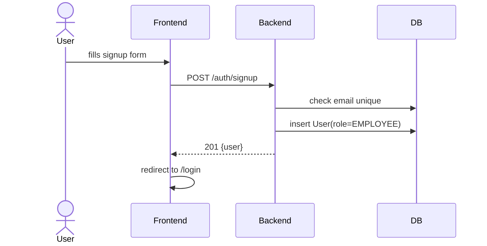
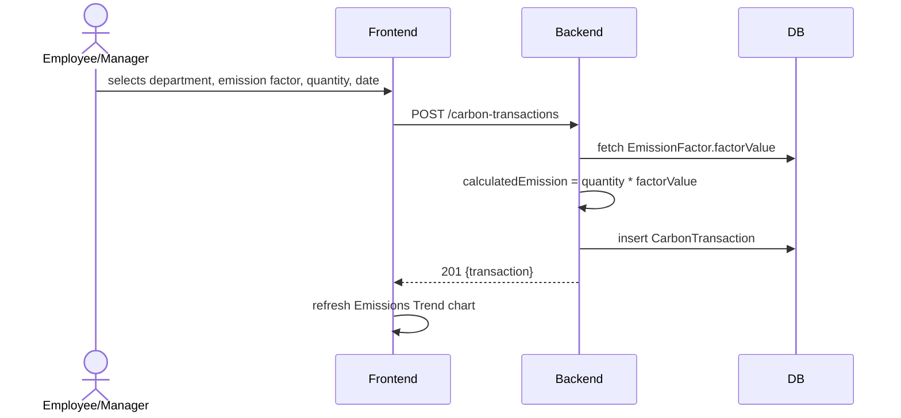
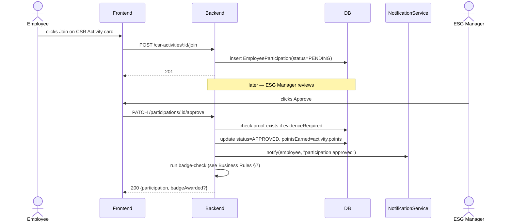
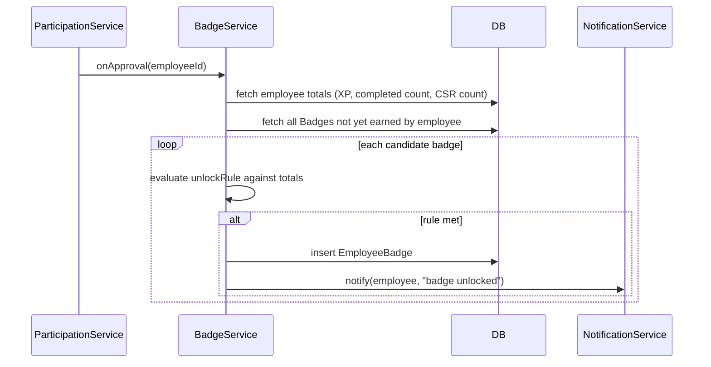
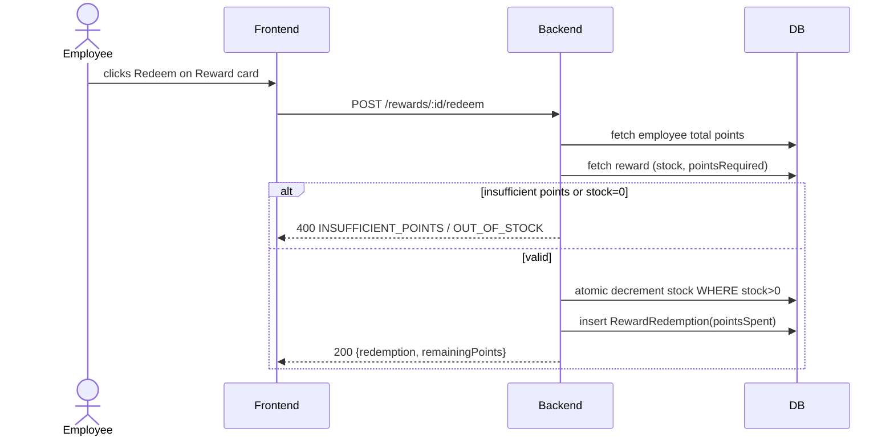
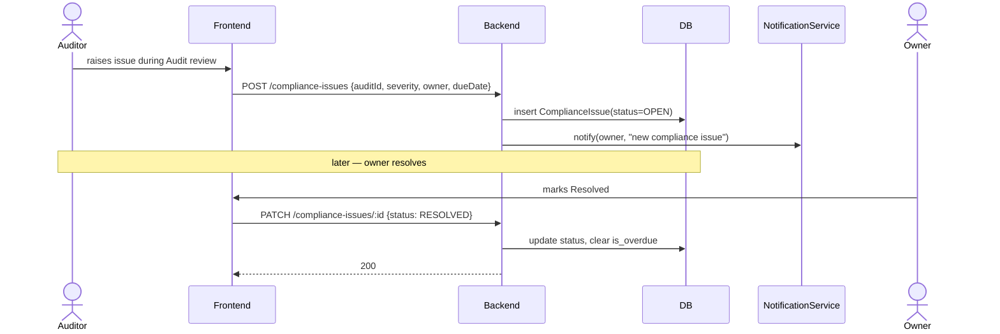

# 06 — Workflows

> Related: [05_BUSINESS_RULES](./05_BUSINESS_RULES.md) · [03_BACKEND_API](./03_BACKEND_API.md)
> Each workflow lists steps, expected output, DB updates, and notifications fired.

## 1. User Registration


- **DB Updates**: new `User` row, `role = EMPLOYEE` always (no self-elevation)
- **Notifications**: none

## 2. Login

- **Steps**: 1) submit credentials 2) backend verifies bcrypt hash 3) JWT issued 4) frontend stores token, redirects to Dashboard
- **Expected Output**: `{ token, user }`
- **DB Updates**: none (read-only)
- **Notifications**: none

## 3. Carbon Transaction Logging


- **DB Updates**: new `CarbonTransaction` row
- **Notifications**: none (score recompute happens on next scheduled run, not synchronously)

## 4. CSR Participation


- **DB Updates**: `EmployeeParticipation` insert then update; possible `EmployeeBadge` insert
- **Notifications**: employee notified of approval/rejection; employee notified if badge unlocked

## 5. Challenge Participation

- **Steps**: 1) employee joins active Challenge → `ChallengeParticipation(PENDING, progress=0)` 2) employee updates progress + proof 3) ESG Manager approves → `xpAwarded = challenge.xp` 4) badge-check runs
- **Expected Output**: participation record with final `xpAwarded`
- **DB Updates**: `ChallengeParticipation` insert/update, possible `EmployeeBadge` insert
- **Notifications**: approval/rejection to employee; badge unlock if applicable

## 6. Badge Assignment (Auto)


- **DB Updates**: 0+ `EmployeeBadge` rows
- **Notifications**: one per badge unlocked

## 7. Reward Redemption


- **DB Updates**: `RewardRedemption` insert, `Reward.stock` decrement
- **Notifications**: confirmation toast only (no persistent notification required)

## 8. Policy Acknowledgement

- **Steps**: 1) policy published → notification fanned out to all employees 2) employee opens Policy, clicks Acknowledge 3) `PolicyAcknowledgement` row inserted (unique per policy+employee)
- **Expected Output**: acknowledgement recorded, employee's pending-acknowledgement count decreases
- **DB Updates**: `PolicyAcknowledgement` insert (idempotent — re-click is a no-op, unique constraint)
- **Notifications**: initial publish notification; reminder notification for stragglers (stretch, cron-driven)

## 9. Compliance Issue Resolution


- **DB Updates**: `ComplianceIssue` insert then update
- **Notifications**: owner notified on creation; ESG Manager notified if it becomes overdue before resolution (nightly cron)

## 10. Report Generation

```mermaid
sequenceDiagram
    actor M as ESG Manager
    participant F as Frontend
    participant B as Backend
    participant DB as DB
    M->>F: clicks Generate on Environmental Report
    F->>B: GET /reports/environmental
    B->>DB: aggregate CarbonTransactions + Goals by department
    B->>B: check today's DepartmentScore exists; if not, compute now
    B-->>F: 200 {report data}
    F->>F: render charts/table, enable CSV export
```
- **DB Updates**: possible `DepartmentScore` insert if none exists for today (lazy computation fallback alongside nightly cron)
- **Notifications**: none

## 11. Settings Update (ESG Configuration)

- **Steps**: 1) Admin toggles e.g. "Auto-award badges on challenge completion" 2) `PATCH /esg-configuration` 3) config row updated (singleton row, `id` fixed)
- **Expected Output**: toggle reflected immediately; affects behavior of §6 badge engine on next trigger
- **DB Updates**: `ESGConfiguration` row update
- **Notifications**: none

---
**Next:** [07_ROLE_PERMISSIONS.md](./07_ROLE_PERMISSIONS.md)
