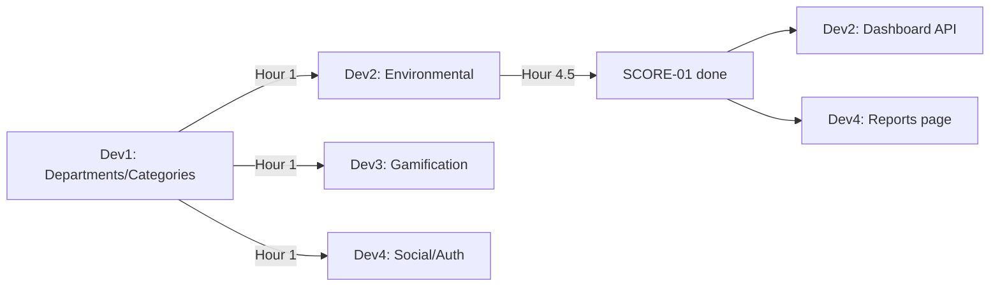

# 09 — Team Assignments

> Related: [08_TASK_BOARD](./08_TASK_BOARD.md) · [01_ARCHITECTURE §8 Dependency Graph](./01_ARCHITECTURE.md#8-dependency-graph-module-build-order)

## Principle

File ownership is split by **module boundary**, not by frontend/backend, so each developer owns a vertical slice (API + page) wherever possible — minimizes cross-developer merge conflicts on the same files. Exception: Hour 1 is shared setup.

## Developer 1 — Foundation & Governance
**Owns**: `backend/prisma/schema.prisma` (shared, but Dev 1 is final arbiter on changes), `backend/src/routes/auth.*`, `.../departments.*`, `.../categories.*`, `.../policies.*`, `.../audits.*`, `.../complianceIssues.*`, `frontend/src/pages/Settings.tsx`

| Task | From Task Board |
|---|---|
| SETUP-01 | Repo + Docker + Prisma init |
| AUTH-01 | Auth API + middleware |
| SETTINGS-01 | Departments + Categories API |
| GOV-01 | Policies API |
| GOV-02 | Audits + Compliance Issues API |
| FE-08 | Settings page |

## Developer 2 — Environmental & Scoring
**Owns**: `.../emissionFactors.*`, `.../carbonTransactions.*`, `.../environmentalGoals.*`, `.../scoreEngine.*`, `.../dashboard.*`, `frontend/src/pages/Environmental.tsx`

| Task | From Task Board |
|---|---|
| ENV-01 | Emission Factors + Carbon Transactions API |
| ENV-02 | Environmental Goals API |
| SCORE-01 | Score Calculation Engine (critical path — everyone depends on this) |
| DASH-01 | Dashboard API |
| FE-03 | Environmental page |

## Developer 3 — Gamification
**Owns**: `.../challenges.*`, `.../challengeParticipations.*`, `.../badges.*`, `.../rewards.*`, `.../leaderboard.*`, `frontend/src/pages/Gamification.tsx`, `frontend/src/pages/Governance.tsx` (after gamification API is stable)

| Task | From Task Board |
|---|---|
| GAME-01 | Challenges API |
| GAME-02 | Badges + auto-award engine |
| GAME-03 | Rewards + Redemption + Leaderboard |
| FE-06 | Gamification page |
| FE-05 | Governance page (second half of hour, after handoff from Dev 1's API) |

## Developer 4 — Frontend Shell & Social
**Owns**: `frontend/src/App.tsx`, `.../components/*` (shared UI kit — coordinate before editing), `.../pages/Dashboard.tsx`, `.../pages/Social.tsx`, `.../pages/Reports.tsx`, `backend/src/routes/social.*` (CSR + Participation)

| Task | From Task Board |
|---|---|
| AUTH-02 | Login/Signup pages + Auth context |
| SOCIAL-01 | CSR Activities + Participation API |
| FE-01 | App shell, sidebar, nav |
| FE-02 | Dashboard page |
| FE-04 | Social page |
| FE-07 | Reports page |

## Merge Conflict Minimization Rules

- [ ] `schema.prisma` is frozen after Hour 1 — any change after that requires a 2-minute team sync, not a solo edit
- [ ] Shared `components/` (DataTable, StatusBadge, ScoreCard, Modal) are built by Dev 4 first in Hour 1–2 and treated as read-only by others; if another dev needs a variant, they compose around it rather than editing the shared file
- [ ] Each developer works on their own feature branch (`feature/dev1-governance`, etc.) and merges to `develop` at each milestone checkpoint (see [00_PROJECT_OVERVIEW §14 Milestones](./00_PROJECT_OVERVIEW.md#14-milestones))
- [ ] No two developers edit `routes/index.ts` simultaneously — each adds their router import as a single-line append, communicated in team chat before pushing

## Handoff Points

---
**Next:** [10_GIT_WORKFLOW.md](./10_GIT_WORKFLOW.md)
