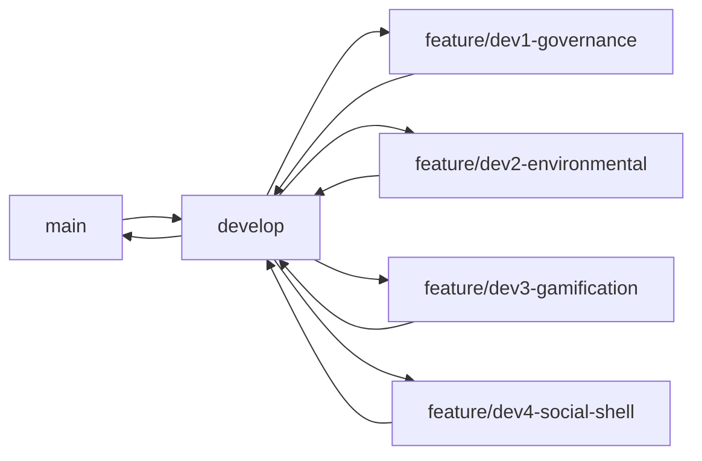

# 10 — Git Workflow

> Related: [09_TEAM_ASSIGNMENTS](./09_TEAM_ASSIGNMENTS.md)

## 1. Branch Strategy



| Branch | Purpose | Protected |
|---|---|---|
| `main` | Demo-ready code only | ✅ — merge only from `develop` at milestones |
| `develop` | Integration branch | ✅ — merge only via PR |
| `feature/*` | One per developer per module | ❌ |
| `bugfix/*` | Post-milestone fixes | ❌ |
| `hotfix/*` | Pre-demo emergency fix directly reviewed | ❌ |

Given the 8-hour window, PR review can be a quick self-check + one teammate glance rather than a formal process — speed matters, but never push straight to `main`.

## 2. Commit Message Convention

```
<type>(<scope>): <short description>

type: feat | fix | chore | docs | refactor
scope: auth | environmental | social | governance | gamification | reports | settings | schema
```
Examples:
- `feat(gamification): add badge auto-award engine`
- `fix(governance): compliance issue creation missing dueDate validation`

## 3. Pull Request Template

```markdown
## What
<one-line summary>

## Task Board Reference
Closes: TASK-ID (e.g. GAME-02)

## Checklist
- [ ] Matches acceptance criteria in 08_TASK_BOARD.md
- [ ] No console errors
- [ ] Tested manually against 13_TESTING_CHECKLIST.md row
```

## 4. Code Review Checklist

- [ ] Controller has no direct Prisma calls (Service/Repository layering respected)
- [ ] New endpoint has RBAC middleware matching [07_ROLE_PERMISSIONS](./07_ROLE_PERMISSIONS.md)
- [ ] Validation errors return the standard error format from [03_BACKEND_API](./03_BACKEND_API.md#2-response-format)
- [ ] No hardcoded secrets

## 5. Merge Strategy

- **Squash merge** feature → develop (keeps `develop` history readable)
- **Merge commit** develop → main (preserves milestone checkpoints for judges reviewing history)

## 6. Conflict Resolution Guide

1. `schema.prisma` conflicts: never auto-resolve — call the team, decide together, one person applies the fix
2. `routes/index.ts` conflicts: trivial, keep both import lines
3. Shared `components/` conflicts: whoever built the original component resolves; the other dev's variant becomes a new component file instead

## 7. Repository Rules

- [ ] `main` and `develop` require PR (not direct push) — configure as GitHub Protected Branches before Hour 0 ends
- [ ] `.env` files gitignored, `.env.example` committed
- [ ] No `node_modules`, `dist`, or `.next` committed

---
**Next:** [11_UI_GUIDELINES.md](./11_UI_GUIDELINES.md)
