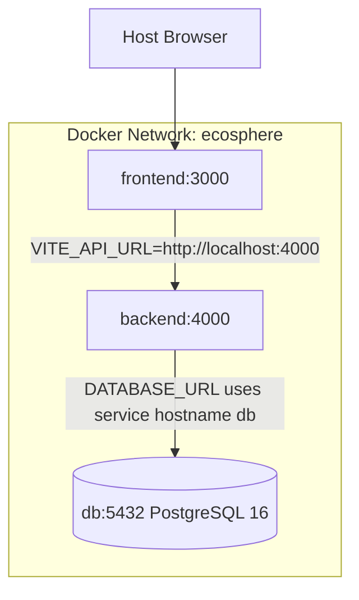

# 12 — Deployment

> Related: [00_PROJECT_OVERVIEW §8 Tech Stack](./00_PROJECT_OVERVIEW.md#8-technology-stack)

## 1. Service Architecture



Services:

- `frontend`: React + Vite + Tailwind development server.
- `backend`: Node.js 22 + Express + TypeScript + Prisma.
- `db`: PostgreSQL 16 with a persistent named volume.

The frontend runs in the browser, so `VITE_API_URL` points to the host-mapped
backend URL. Container-to-container database traffic uses the internal hostname
`db`, never `localhost`.

## 2. Dockerfiles

Both app Dockerfiles use `node:22-bookworm-slim`, install dependencies with
`npm ci`, run as the non-root `node` user, expose the development port, and run
the package's documented development command.

Dependency manifests are copied before source files for build cache reuse.
Source directories are bind-mounted by Compose for hot reload.

## 3. Compose Services

Root `docker-compose.yml` defines:

| Service | Image/Build | Host Port | Health Check |
|---|---|---:|---|
| `db` | `postgres:16` | `${POSTGRES_PORT:-5432}` | `pg_isready` |
| `backend` | `./backend` | `${BACKEND_PORT:-4000}` | `GET /ready` |
| `frontend` | `./frontend` | `${FRONTEND_PORT:-3000}` | `GET /` |

Startup order:

1. `db` starts and must become healthy.
2. `backend` starts after `db`, runs `prisma generate` and `prisma migrate deploy`, then serves Express.
3. `frontend` starts after `backend` is healthy.

## 4. Ports

| Variable | Default | Purpose |
|---|---:|---|
| `FRONTEND_PORT` | `3000` | Host port for Vite |
| `BACKEND_PORT` | `4000` | Host port for Express |
| `POSTGRES_PORT` | `5432` | Host port for PostgreSQL development access |

## 5. Volumes

| Volume | Purpose |
|---|---|
| `postgres_data` | Persistent PostgreSQL data |
| `backend_node_modules` | Container-only backend dependencies |
| `frontend_node_modules` | Container-only frontend dependencies |

The app source is bind-mounted with `:z` for Fedora SELinux compatibility. Host
`node_modules` directories are not mounted into containers, which avoids CPU
architecture conflicts between Fedora x86_64, Intel Macs, and Apple Silicon.

## 6. Environment Variables

Copy the root template before starting:

```bash
cp .env.example .env
```

| Variable | Used By | Example |
|---|---|---|
| `POSTGRES_USER` | `db`, `DATABASE_URL` | `ecosphere` |
| `POSTGRES_PASSWORD` | `db`, `DATABASE_URL` | `ecosphere_dev_password` |
| `POSTGRES_DB` | `db`, `DATABASE_URL` | `ecosphere` |
| `POSTGRES_PORT` | Compose port mapping | `5432` |
| `DATABASE_URL` | backend, Prisma | `postgresql://ecosphere:ecosphere_dev_password@db:5432/ecosphere` |
| `BACKEND_PORT` | backend, Compose port mapping | `4000` |
| `FRONTEND_PORT` | frontend, Compose port mapping | `3000` |
| `NODE_ENV` | backend | `development` |
| `JWT_SECRET` | backend auth foundation | development placeholder only |
| `CORS_ORIGIN` | backend CORS | `http://localhost:3000` |
| `VITE_API_URL` | frontend browser API calls | `http://localhost:4000` |

The backend validates required environment variables at startup and fails with a
clear error if any required value is missing or malformed.

## 7. Development Startup

```bash
cp .env.example .env
docker compose up --build
```

Background mode:

```bash
docker compose up -d --build
```

Status and logs:

```bash
docker compose ps
docker compose logs -f
docker compose logs -f backend
docker compose logs -f frontend
```

Refresh dependency volumes after lockfile changes:

```bash
# When frontend/package-lock.json changes
docker compose run --rm frontend npm ci
docker compose restart frontend

# When backend/package-lock.json changes
docker compose run --rm backend npm ci
docker compose restart backend
```

The Compose setup stores service dependencies in named `node_modules` volumes.
Those volumes can retain older dependencies after `frontend/package-lock.json`
or `backend/package-lock.json` changes. The commands above refresh only the
affected dependency volume and restart that service.

Stop:

```bash
docker compose down
```

Reset database data:

```bash
docker compose down -v
```

Warning: `docker compose down -v` deletes the local PostgreSQL named volume.
Do not use `docker compose down -v` for routine dependency refresh because it
also deletes PostgreSQL data.

## 8. Health Checks

Backend:

- `GET http://localhost:4000/health` checks only the backend process.
- `GET http://localhost:4000/ready` checks PostgreSQL connectivity with `SELECT 1`.

Database:

- Compose uses `pg_isready` against the configured database and user.

Frontend:

- Compose checks that the Vite server responds on port `3000`.
- The baseline page calls the backend health endpoint and displays loading,
  success, and error states.

## 9. Troubleshooting

- If the backend fails immediately, check `docker compose logs -f backend` for
  environment validation errors.
- If `/ready` returns `503`, check `docker compose logs -f db` and confirm
  `DATABASE_URL` uses `db:5432`, not `localhost`.
- If dependencies behave differently across machines after a lockfile changes,
  run the dependency refresh commands in §7. Use `docker compose down -v` only
  when you deliberately intend to delete PostgreSQL data as well.

## 10. Fedora SELinux Notes

Bind mounts use `:z` so Docker can relabel the project files for shared
container access on SELinux systems. If a Fedora machine still reports bind
mount permission errors, confirm Docker is running with SELinux support and
that the repository is located on a filesystem that supports labels.

Validated on 2026-07-12 with Fedora 44 Workstation and SELinux Enforcing:
backend and frontend containers could read and write their `/app` bind mounts,
hot reload worked from host source edits, and final logs showed no bind-mount
permission errors.

## 11. macOS Notes

The images are official multi-architecture images and work on Apple Silicon and
Intel Macs. Do not install dependencies on the host and mount host
`node_modules`; use the Compose-managed dependency volumes.

## 12. Apple Silicon Compatibility

No `platform:` override is set. Docker Desktop should pull ARM64 variants on
Apple Silicon and AMD64 variants on Intel/Fedora automatically.

## 13. Production Direction

This repository currently ships a development baseline only. A future
production deployment should add separate production targets, compile the
frontend to static assets, run the backend from `dist/`, disable bind mounts,
and use externally managed secrets.

---
**Next:** [13_TESTING_CHECKLIST.md](./13_TESTING_CHECKLIST.md)
